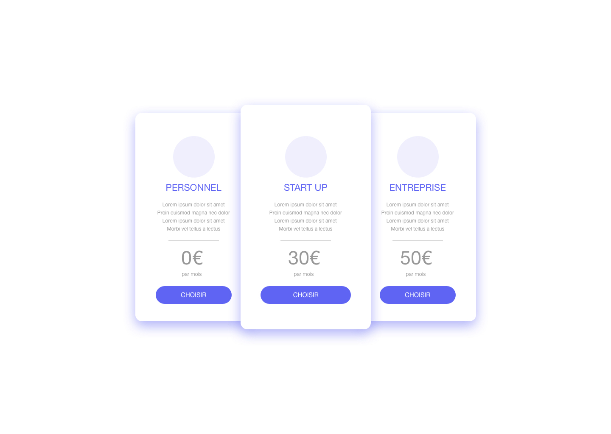

# Tests d'intégration

### 1. Tableau de prix

L'équipe marketing de She Travels va proposer une offre de placement de produit à ses partenaires. Pour cela, nous devons créer un tableau de prix :

##### Votre mission : 

- Réaliser le tableau de prix en vous rapprochant au maximum de l'image (limitez-vous à 2h maximum).

##### Requis : 

- Livrer le dossier de travail complet au format `.zip` (le dossier doit contenir un fichier `.html` lisible dans un navigateur avec les liens CSS & co).

##### À savoir : 

- Le rendu ne doit pas être responsive.
- La couleur, les ombres et les tailles de textes peuvent être approximatifs.
- Vous êtes libre d'utiliser le language de développement que vous souhaitez (css / less / sass / etc.) et vous pouvez utiliser des scripts de compilation CSS ou pas (webpack / gulp / etc.).
- Vous pouvez nous poser des questions sur l'exercice si besoin.
- Faites-vous plaisir !

---

### 2. Page recrutement

Vous êtes développeur au sein de l'équipe technique She Travels. L'entreprise recrute de plus en plus et vous avez envie d'améliorer les pages de recrutement du site : https://www.copinesdevoyage.com/recrutement pour que la lecture soit plus agréable (limitez-vous à 3h maximum).

##### Votre mission : 

- Vous proposerez une version plus agréable pour présenter nos offres d'emploies.
- Vous créerez : 
    - La page de listing des offres.
    - 1 page de contenu d'une offre (en reprenant le contenu de la page https://www.copinesdevoyage.com/recrutement/developpeur-fullstack-junior).

##### Requis : 

- Utiliser Bootstrap 4.
- Les pages doivent être accessibles sur tous les écrans (ordinateur & mobile).
- Livrer le dossier de travail complet au format `.zip` (le dossier doit contenir 2 fichiers `.html` lisibles dans un navigateur avec les liens CSS & co).

##### À savoir : 

- Vous êtes libre d'utiliser le language de développement que vous souhaitez.
- La manière d'inclure Bootstrap dans le projet est libre.
- Vous pouvez nous poser des questions sur l'exercice si besoin.
- Faites-vous plaisir !
