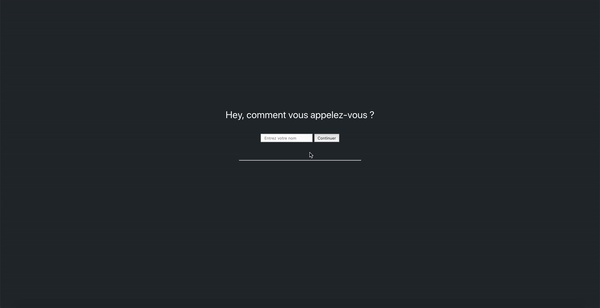

## Pré-requis

- Installer [NODE & NPM](https://nodejs.org/en/) (version de npm supérieur à 5.2, and node supérieur à 5.6).
- Installer NPX : `npm i -g npx`.

## 1. App de bienvenue

#### Votre mission :

- Installer une app React et dire bonjour à un utilisateur une fois qu'il aura entré son nom (limitez-vous à 2h maximum).

#### Livrable :

- Nous présenter votre travail et répondre à nos questions.

#### À savoir :

- Nous jugeons le fonctionnel et l'approche React. Le style graphique ne compte pas !
- Vous pouvez nous poser des questions sur l'exercice si besoin.
- Faites-vous plaisir !
